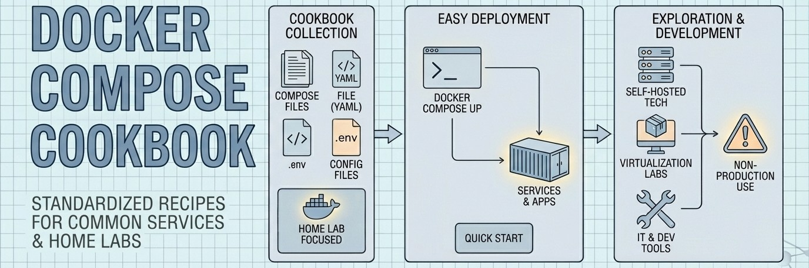
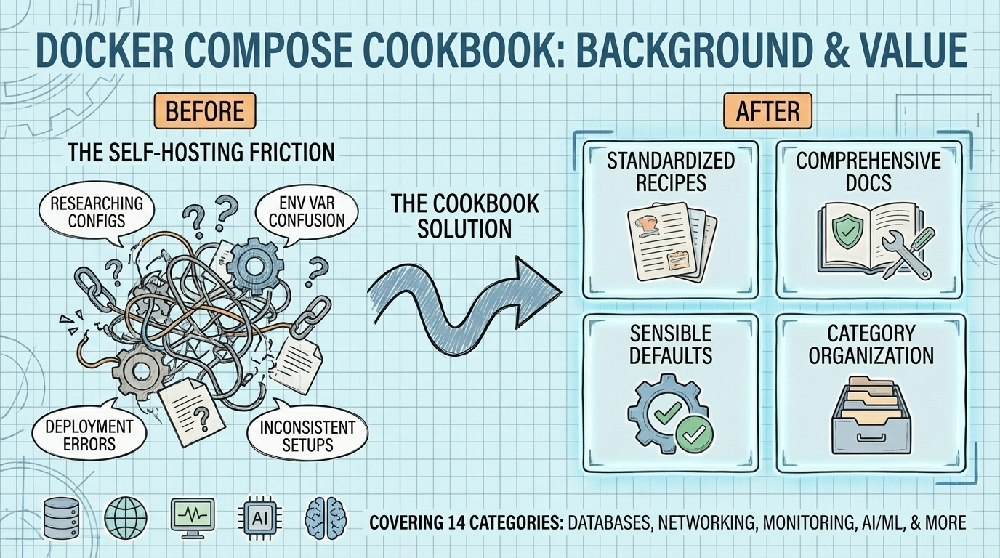

<!--
---
title: "Docker Compose Cookbook"
description: "Curated Docker Compose configurations for self-hosted services"
author: "VintageDon"
date: "2025-01-03"
version: "3.0"
status: "Active"
tags:
  - type: project-root
  - domain: [docker, self-hosting, homelab]
  - tech: [docker, compose, yaml]
related_documents:
  - "[Docker Compose Docs](https://docs.docker.com/compose/)"
  - "[RadioAstronomy.io](https://github.com/radioastronomyio)"
---
-->

# 🐳 Docker Compose Cookbook



[](https://www.docker.com/)
[](https://docs.docker.com/compose/)
[](LICENSE)
[]()

> Curated Docker Compose configurations for self-hosted services, organized by category with comprehensive documentation.

This cookbook provides copy-and-deploy Docker Compose configurations for common infrastructure services. Each recipe includes sensible defaults, environment templates, and documentation covering configuration, security, performance tuning, and troubleshooting. Clone a recipe, customize the `.env` file, and deploy in minutes.

---

## 🔭 Background



Self-hosting services requires researching Docker configurations, understanding environment variables, and troubleshooting deployment issues. This friction slows adoption and leads to inconsistent setups across environments.

The Docker Compose Cookbook addresses this by providing:

- Standardized recipes — Every recipe follows the same structure, so once you've used one, you understand them all
- Comprehensive documentation — Each recipe includes configuration guides, security considerations, and troubleshooting help
- Sensible defaults — Configurations work out of the box while remaining customizable
- Category organization — Services grouped by function for easy discovery

---

## 🎯 Target Audience

| Audience | Use Case |
|----------|----------|
| Home Lab Enthusiasts | Deploy self-hosted alternatives to cloud services |
| DevOps Learners | Learn Docker Compose patterns through working examples |
| Small Teams | Quick infrastructure setup without enterprise complexity |
| Developers | Local development environments mirroring production |

---

## 📦 Categories

| Category | Recipes | Status | Jump |
|----------|---------|--------|------|
| AI & Machine Learning | 16 | Active | [→](#ai--machine-learning) |
| Automation & Orchestration | 6 | Active | [→](#automation--orchestration) |
| Databases | 13 | Active | [→](#databases) |
| Development & CI/CD | 8 | Active | [→](#development--cicd) |
| Monitoring & Logging | 5 | Active | [→](#monitoring--logging) |
| Networking | 6 | Active | [→](#networking) |
| Home Automation | 1 | Active | [→](#home-automation) |
| Media & Entertainment | 1 | Active | [→](#media--entertainment) |
| Container Management | 0 | Planned | [→](#container-management) |
| Data Pipelines | 0 | Planned | [→](#data-pipelines) |
| Messaging & Collaboration | 0 | Planned | [→](#messaging--collaboration) |
| Security | 0 | Planned | [→](#security) |
| Storage Solutions | 0 | Planned | [→](#storage-solutions) |
| Web Application Servers | 0 | Planned | [→](#web-application-servers) |

---

## AI & Machine Learning

Docker Compose recipes for local LLM inference, AI tools, image generation, and machine learning platforms. GPU acceleration supported via NVIDIA Container Toolkit.

| Subcategory | Description | Recipes |
|-------------|-------------|---------|
| [llm-inference](ai-ml/llm-inference/README.md) | LLM inference engines | Ollama, LocalAI, Text-Generation-WebUI, vLLM |
| [chat-interfaces](ai-ml/chat-interfaces/README.md) | Chat UIs and RAG platforms | Open WebUI, LibreChat, AnythingLLM, PrivateGPT |
| [image-generation](ai-ml/image-generation/README.md) | Image synthesis tools | Automatic1111, ComfyUI, Fooocus, InvokeAI, SwarmUI |
| [audio-intelligence](ai-ml/audio-intelligence/README.md) | Speech recognition | Faster Whisper, Wyoming Whisper |
| [document-processing](ai-ml/document-processing/README.md) | Document manipulation with OCR | Stirling-PDF |

[→ Full details](ai-ml/README.md)

---

## Automation & Orchestration

Infrastructure automation, workflow engines, and AI agent platforms.

| Recipe | Description |
|--------|-------------|
| [ansibleawx-postgres-redis](automation-orchestration/ansibleawx-postgres-redis/README.md) | Ansible AWX with PostgreSQL and Redis |
| [rundeck](automation-orchestration/rundeck/README.md) | Job scheduler and runbook automation |
| [stackstorm-mongodb-rabbitmq-postgres](automation-orchestration/stackstorm-mongodb-rabbitmq-postgres/README.md) | Event-driven automation platform |
| [n8n](automation-orchestration/n8n/README.md) | Workflow automation with LangChain integration |
| [flowise](automation-orchestration/flowise/README.md) | Low-code LangChain app builder |
| [dify](automation-orchestration/dify/README.md) | GenAI application development platform |

[→ Full details](automation-orchestration/README.md)

---

## Databases

SQL, NoSQL, time series, vector, and graph databases organized by data model.

| Subcategory | Description | Recipes |
|-------------|-------------|---------|
| [relational](databases/relational/README.md) | SQL databases | MySQL, MariaDB, SQLite |
| [document](databases/document/README.md) | Document stores | MongoDB, CouchDB |
| [key-value](databases/key-value/README.md) | In-memory stores | Redis |
| [graph](databases/graph/README.md) | Graph databases | Neo4j |
| [timeseries](databases/timeseries/README.md) | Time series databases | InfluxDB |
| [vector](databases/vector/README.md) | Vector embeddings for RAG | Qdrant, Milvus, Weaviate, ChromaDB |
| [wide-column](databases/wide-column/README.md) | Wide-column stores | Cassandra |
| [management](databases/management/README.md) | Admin tools | Planned |

[→ Full details](databases/README.md)

---

## Development & CI/CD

Git servers, CI/CD pipelines, and development tools.

| Recipe | Description |
|--------|-------------|
| [gitea-mysql](development-ci-cd/gitea-mysql/README.md) | Gitea with MySQL backend |
| [gitea-postgresql](development-ci-cd/gitea-postgresql/README.md) | Gitea with PostgreSQL backend |
| [gitea-sqlite3](development-ci-cd/gitea-sqlite3/README.md) | Gitea with SQLite backend |
| [gitlabce](development-ci-cd/gitlabce/README.md) | GitLab Community Edition |
| [gogs-mysql](development-ci-cd/gogs-mysql/README.md) | Gogs with MySQL backend |
| [gogs-postgres](development-ci-cd/gogs-postgres/README.md) | Gogs with PostgreSQL backend |
| [gogs-sqlite3](development-ci-cd/gogs-sqlite3/README.md) | Gogs with SQLite backend |
| [jenkins-sqlite3](development-ci-cd/jenkins-sqlite3/README.md) | Jenkins CI server |

[→ Full details](development-ci-cd/README.md)

---

## Monitoring & Logging

Metrics collection, visualization, and log aggregation.

| Recipe | Description |
|--------|-------------|
| [cacti-mysql](monitoring-logging/cacti-mysql/README.md) | Network graphing with RRDtool |
| [fluentd](monitoring-logging/fluentd/README.md) | Unified logging layer |
| [grafana](monitoring-logging/grafana/README.md) | Metrics visualization |
| [graylog-elasticsearch-mongodb](monitoring-logging/graylog-elasticsearch-mongodb/README.md) | Centralized log management |
| [Prometheus](monitoring-logging/Prometheus/README.md) | Time series metrics database |

[→ Full details](monitoring-logging/README.md)

---

## Networking

VPNs, DNS servers, ad blocking, and network tools.

| Recipe | Description |
|--------|-------------|
| [adguard-home](networking/adguard-home/README.md) | Network-wide ad blocking |
| [openvpn](networking/openvpn/README.md) | OpenVPN server |
| [pihole](networking/pihole/README.md) | DNS-based ad blocking |
| [searxng](networking/searxng/README.md) | Privacy-respecting metasearch engine |
| [softethervpn](networking/softethervpn/README.md) | Multi-protocol VPN server |
| [wireguard](networking/wireguard/README.md) | Modern VPN tunnel |

[→ Full details](networking/README.md)

---

## Home Automation

Smart home platforms, IoT, and home infrastructure.

| Recipe | Description |
|--------|-------------|
| [frigate](home-automation/frigate/README.md) | AI-powered NVR with object detection |

Planned: Home Assistant, Node-RED, Mosquitto MQTT.

[→ Full details](home-automation/README.md)

---

## Media & Entertainment

Media servers, photo management, and streaming platforms.

| Recipe | Description |
|--------|-------------|
| [immich](media-entertainment/immich/README.md) | Self-hosted Google Photos alternative with ML |

Planned: Jellyfin, Plex, *arr stack.

[→ Full details](media-entertainment/README.md)

---

## Container Management

Container orchestration interfaces and management tools.

Planned: Portainer, Dockge, Watchtower.

[→ Full details](container-management/README.md)

---

## Data Pipelines

Workflow orchestration, ETL, and data processing.

Planned: Airflow, Dagster, Prefect.

[→ Full details](data-pipelines/README.md)

---

## Messaging & Collaboration

Chat platforms, email servers, and team communication.

Planned: Matrix, Mattermost, Mailcow.

[→ Full details](messaging-collaboration/README.md)

---

## Security

Authentication, secrets management, and vulnerability scanning.

Planned: Keycloak, Authelia, Vaultwarden.

[→ Full details](security/README.md)

---

## Storage Solutions

Object storage, file synchronization, and backup tools.

Planned: MinIO, Nextcloud, Syncthing.

[→ Full details](storage-solutions/README.md)

---

## Web Application Servers

Reverse proxies, load balancers, and web servers.

Planned: Traefik, Caddy, Nginx Proxy Manager.

[→ Full details](web-application-servers/README.md)

---

## 🚀 Quick Start

```bash
# Clone the repository
git clone https://github.com/radioastronomyio/docker-compose-cookbook.git
cd docker-compose-cookbook

# Navigate to desired recipe
cd databases/relational/mysql

# Copy and customize environment
cp .env.example .env
nano .env  # or your preferred editor

# Deploy
docker compose up -d

# Verify
docker compose ps
docker compose logs
```

---

## 📋 Recipe Structure

Every recipe follows a standardized structure:

```
recipe-name/
├── docker-compose.yml    # Main compose configuration
├── .env.example          # Environment template (copy to .env)
├── README.md             # Quick start and overview
├── docs/                 # Extended documentation (optional)
│   ├── CONFIGURATION.md
│   ├── SECURITY.md
│   └── TROUBLESHOOTING.md
└── scripts/              # Helper scripts (optional)
```

---

## 🔧 Requirements

| Requirement | Version | Notes |
|-------------|---------|-------|
| Docker Engine | 20.10+ | [Install guide](https://docs.docker.com/engine/install/) |
| Docker Compose | v2+ | Included with Docker Desktop; [standalone install](https://docs.docker.com/compose/install/) |
| Git | Any | For cloning the repository |
| NVIDIA Container Toolkit | Latest | Required for GPU-accelerated recipes |

---

## 🤝 OSS Program Support

This repository benefits from open source programs that provide tooling to qualifying public repositories.

| Program | Provides | Use Case |
|---------|----------|----------|
| [Greptile](https://greptile.com) | AI code review | PR review, codebase Q&A |
| [Atlassian](https://www.atlassian.com/software/views/open-source-license-request) | Jira, Confluence | Project tracking, documentation |

---

## 🌟 Open Science Philosophy

We practice open science and open methodology — our version of "showing your work":

- Research methodologies are fully documented and repeatable
- Infrastructure configurations are version-controlled and automated
- Scripts and pipelines are published so others can learn, adapt, or improve them
- Learning processes are captured and shared for community benefit

All projects operate under open source licenses (primarily MIT) to ensure maximum reproducibility.

---

## 🤝 Contributing

Contributions are welcome! To add a new recipe:

1. Copy the `skeleton/` template to the appropriate category
2. Customize the compose file and documentation
3. Test the deployment locally
4. Submit a pull request

See [CONTRIBUTING.md](CONTRIBUTING.md) for detailed guidelines.

---

## 📄 License

[MIT](LICENSE) © 2025 VintageDon

---

## 🙏 Acknowledgments

- [Docker](https://www.docker.com/) — Container platform
- [LinuxServer.io](https://www.linuxserver.io/) — Well-maintained Docker images
- [Awesome-Selfhosted](https://github.com/awesome-selfhosted/awesome-selfhosted) — Self-hosting inspiration
- [RadioAstronomy.io](https://github.com/radioastronomyio) — Research organization

---

Last Updated: January 3, 2025 | 56 Active Recipes | 14 Categories
